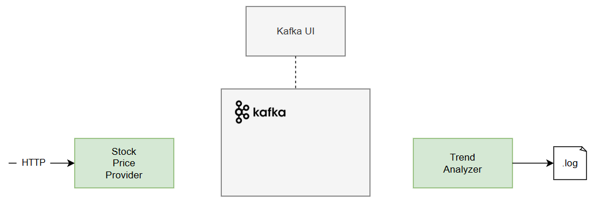
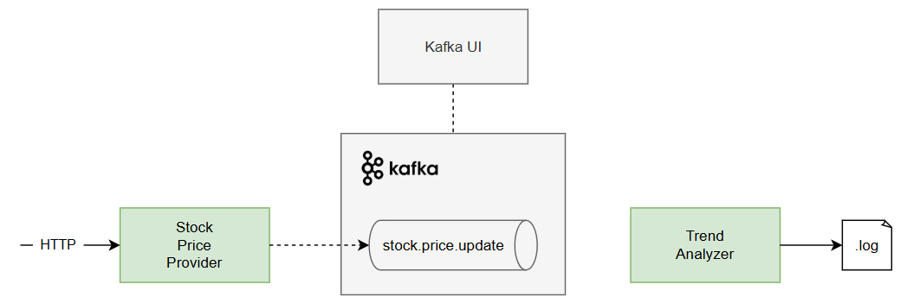
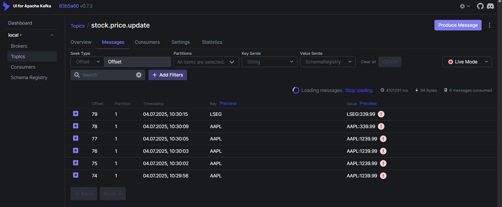

## 1.1. Producing Kafka Messages

In this section, we will modify our Spring Boot application to produce messages to a Kafka topic.

Checkout [branch]((https://github.com/etrandafir93/my-courses/tree/kafka-essentials/start)) 
`kafka-essentials/start`: our codebase is in the initial state,
where our two components are not yet connected via Kafka:




The goal of section 1.1. is to enable _StockPriceProvider_ to produce messages to a Kafka topic
whenever it receives a price update via HTTP:



You can find all the changes and the final version of the code [here](https://github.com/etrandafir93/my-courses/commit/a004c43ca2aca2adb4e63a368926c04ae2700b5f).

For other questions or additional support, feel free to [reach out](https://www.linkedin.com/in/emanueltrandafir/).

### Add Spring Kafka
To start producing Kafka messages, we need to add the
[spring-kafka](https://mvnrepository.com/artifact/org.springframework.kafka/spring-kafka) dependency to our `pom.xml`:

```xml
<dependency>
    <groupId>org.springframework.kafka</groupId>
    <artifactId>spring-kafka</artifactId>
</dependency>
```

### Configure Kafka Producer

Next, we configure the Kafka producer in our application.
We'll specify the Kafka broker address (`localhost:9092`),
as defined in our `docker-compose.yaml`.
We'll also set the key and value serializers
to Apache Kafka's `StringSerializer`.
Finally, we'll define a custom property for the topic name in `application.yaml`:

```yaml
topic:
  stock-price-update: stock.price.update

spring:
  kafka:
    bootstrap-servers: localhost:9092
    producer:
      key-serializer: org.apache.kafka.common.serialization.StringSerializer
      value-serializer: org.apache.kafka.common.serialization.StringSerializer
```

### Update _StockPriceProvider_ to Produce Messages

Now, we update the `StockPriceProvider` class to produce messages to the Kafka topic.
We'll inject a `KafkaTemplate<String, String>` bean using constructor injection
(leveraging Lombok's `@RequiredArgsConstructor`)
and use the `@Value` annotation to inject the topic name:

```java
@RestController
@RequestMapping("/api/stocks")
@RequiredArgsConstructor
public class StockPriceProvider {

    @Value("${topic.stock-price-update}")
    private String stockPriceUpdateTopic;

    private final KafkaTemplate<String, String> kafkaTemplate;

    // ...
}
```

Finally, we modify the `sendStockUpdate()` method to send messages to the Kafka topic.
The payload will be a concatenation of the stock ticker and price,
separated by a colon:

```java
private void sendStockUpdate(String ticker, double price) {
    log.info(blue("Attempting to send stock update for {}: {}"), ticker, price);

    String stockPriceUpdate = ticker + ":" + price;

    kafkaTemplate.send(stockPriceUpdateTopic, ticker, stockPriceUpdate);
    log.info(blue("Message sent to Kafka topic '{}': Key='{}', Payload='{}'"),
        stockPriceUpdateTopic, ticker, stockPriceUpdate);
}
```

### Test the Kafka Producer

To test this, run the application and execute the [provided curl command](../put-stock-price.cmd):

```cmd
curl -X PUT "http://localhost:8080/api/stocks/AAPL?price=198.40"
```

We can verify the message in Kafka using the Kafka UI tool provided by the docker-compose.
To do so, simply open Kafka UI at [localhost:8085](http://localhost:8085),
and navigate to the `stock.price.update` topic.
Then, if we select the _Messages_ tab, we should see the message we just sent from the CLI:




