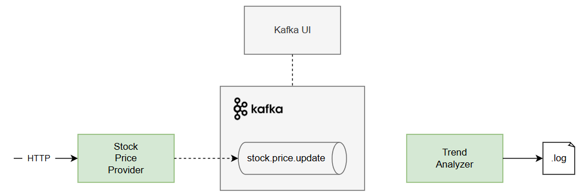
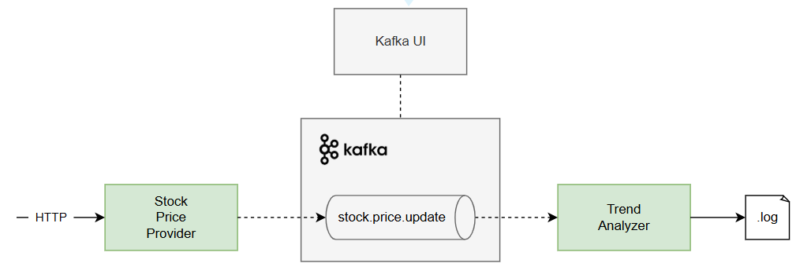

## 1.2. Consuming Kafka Messages

In this section, we'll update our `TradeAnalyzer` component
and subscribe to the `stock.price.update` topic.

To get started, checkout the tag `1-1-produce-messages`:
```git
git checkout 1-1-produce-messages
```

### Lesson Goal

Our codebase is where we left off in the previous section,
where we successfully produced messages to the Kafka topic:



Our goal is to connect our `TradeAnalyzer` th the Kafka topic. 
As a result, we'll be able to test the full flow:



Try to follow along!

If you get stuck, you can find all the changes and the final version of the code [here](https://github.com/etrandafir93/my-courses/commit/986757c4da44f70923247602552c14f58c86181a).
For other questions or additional support, feel free to [reach out](https://www.linkedin.com/in/emanueltrandafir/).

### Configure Kafka Consumer

Since we already have Spring  Kafka in our application,
we only need to configure the Kafka consumer in our `application.yaml`.

We'll set the key and value deserializers to Apache Kafka's `StringDeserializer`,
and specify the group ID and auto offset reset policy:

```yaml
spring:
  kafka:
    bootstrap-servers: localhost:9092
#    producer: 
#     ...
    consumer:
      key-deserializer: org.apache.kafka.common.serialization.StringDeserializer
      value-deserializer: org.apache.kafka.common.serialization.StringDeserializer
      group-id: learning-app-group
      auto.offset.reset: earliest
```

By setting `auto.offset.reset: earliest`, we ensure that each new consumer 
will start reading messages from the beginning of the topic.

### Add the _@KafkaListener_ Annotation

Now, we simply need to annotate the `analyzeStockPriceUpdate()` method with `@KafkaListener`:

```java
@Component
public class TrendAnalyzer {

    @KafkaListener(topics = "${topic.stock-price-update}")
    public void analyzeStockPriceUpdate(String message) {
        // ...
    }
}
```
As we can see, we also need to specify the topic name - 
and we referenced the custom property defined our `application.yaml`.

### Test the Whole Flow

That's it! Let's start the application and send the PUT request to produce a few messages:

```bash
curl -X PUT "http://localhost:8080/api/stocks/AAPL?price=198.40"
```

Now, we can read the application logs to see if the message was consumed successfully:

```text
2025-07-04T20:57:15.794+03:00  INFO [kafka-app] [nio-8080-exec-2] i.g.e.c.k.s.price.StockPriceProvider     : Received REST request to update stock price for AAPL: 198.4
2025-07-04T20:57:15.794+03:00  INFO [kafka-app] [nio-8080-exec-2] i.g.e.c.k.s.price.StockPriceProvider     : Attempting to send stock update for AAPL: 198.4
2025-07-04T20:57:15.795+03:00  INFO [kafka-app] [nio-8080-exec-2] i.g.e.c.k.s.price.StockPriceProvider     : Message sent to Kafka topic 'stock.price.update' Payload='AAPL:198.4'
2025-07-04T20:57:15.809+03:00  INFO [kafka-app] [ntainer#0-0-C-1] i.g.e.c.k.trend.analysis.TrendAnalyzer   : Received stock price update message: AAPL:198.4
2025-07-04T20:57:15.810+03:00  INFO [kafka-app] [ntainer#0-0-C-1] i.g.e.c.k.trend.analysis.TrendAnalyzer   : Stock AAPL trend: NO CHANGE 😐 Price: 198.4
```

### Next Steps?

In the [next lesson](TBD) we'll learn about how to scale up our application,
leveraging the power of Kafka's partitioning and consumer groups.